# AXIOS Command Guide

How to extract, start, and use every supported AXIOS investigation mode.

> **Select a mode. Choose an optional focus. Run. Review. Save only when needed.**

---

## Contents

- [Requirements](#requirements)
- [Extract and start](#extract-and-start)
- [Quick reference](#quick-reference)
- [Choosing a mode](#choosing-a-mode)
- [Help](#help)
- [User](#user)
- [Administrator](#administrator)
- [System](#system)
- [Network](#network)
- [Persistence](#persistence)
- [Software](#software)
- [Results](#results)
- [Developer commands](#developer-commands)
- [Saving evidence](#saving-evidence)
- [Parameters](#parameters)
- [Understanding results](#understanding-results)
- [Troubleshooting](#troubleshooting)
- [Fastest safe starting points](#fastest-safe-starting-points)

---

## Requirements

- Windows
- Windows PowerShell
- The official `axios-windows-investigation.zip` release package
- Administrator PowerShell, **only** for `Administrator` mode
- Authorization to investigate the system or network target

AXIOS needs **no installation**. Extract the package and run `axios.ps1`.

---

## Extract and start

1. Download `axios-windows-investigation.zip` from **GitHub Releases** and place it in your `Downloads` folder.
2. Open PowerShell and run:

```powershell
$Zip  = "$env:USERPROFILE\Downloads\axios-windows-investigation.zip"
$Root = "$env:USERPROFILE\Downloads\AXIOS"

Expand-Archive -LiteralPath $Zip -DestinationPath $Root -Force
Set-Location "$Root\axios-windows-investigation"

.\axios.ps1 -Mode Help
```

Example extracted package directory:

```text
C:\Users\TestUser\Downloads\AXIOS\axios-windows-investigation
```

In later sessions, return with:

```powershell
Set-Location "$env:USERPROFILE\Downloads\AXIOS\axios-windows-investigation"
```

---

## Quick reference

| Command | Admin? | Purpose |
|---|:---:|---|
| `.\axios.ps1 -Mode Help` | No | Show commands and parameters |
| `.\axios.ps1 -Mode User` | No | Standard-user security assessment |
| `.\axios.ps1 -Mode Administrator` | **Yes** | Complete 42-stage investigation |
| `.\axios.ps1 -Mode System` | No | System and security posture |
| `.\axios.ps1 -Mode Network` | No | Network security assessment |
| `.\axios.ps1 -Mode Persistence` | No | Persistence assessment |
| `.\axios.ps1 -Mode Software` | No | Software and update assessment |
| `.\axios.ps1 -Mode Results` | No | Show the latest session result |

**Developer commands** (hidden from public Help):

| Command | Admin? | Purpose |
|---|:---:|---|
| `.\axios.ps1 -Mode DeveloperExposure` | No | Advanced exposure assessment |
| `.\axios.ps1 -Mode DeveloperCredential` | No | Display the active Wi-Fi credential |
| `.\axios.ps1 -Mode DeveloperArchive` | No | Decrypt an AXIOS credential archive |

---

## Choosing a mode

| I want to... | Use |
|---|---|
| See what AXIOS can do | `Help` |
| Check my own exposure without admin | `User` |
| Run the deepest possible investigation | `Administrator` |
| Check hardware, boot, and kernel posture | `System` |
| Review network config, listeners, connections | `Network` |
| Look for startup and persistence mechanisms | `Persistence` |
| Review installed software and updates | `Software` |
| Re-read the last result | `Results` |

---

## Help

```powershell
.\axios.ps1 -Mode Help
```

Displays public modes, focused System and Network branches, parameters, privilege requirements, and examples. Use it to confirm the interface included in **your** package.


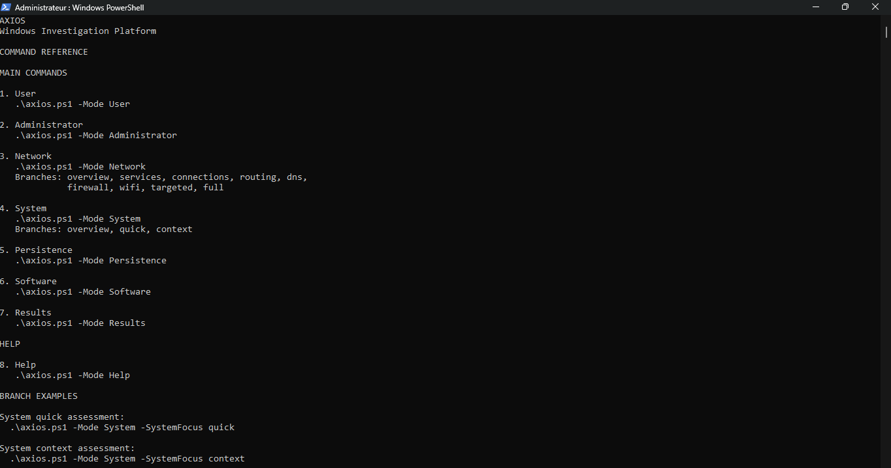

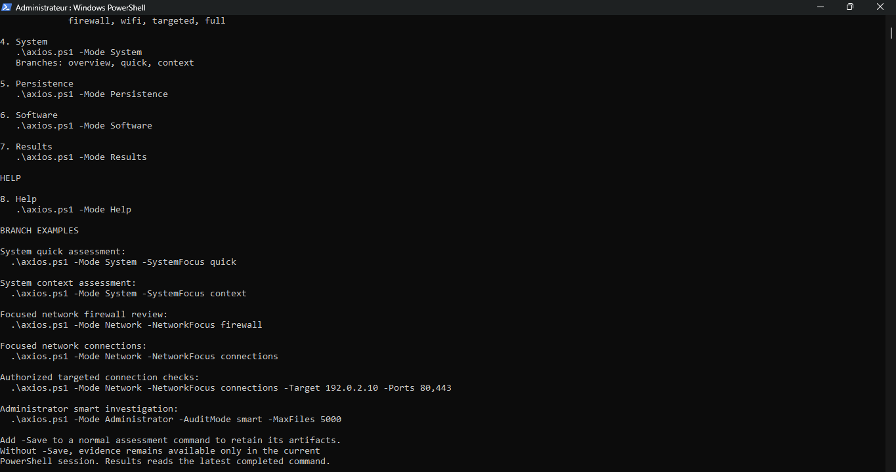

---

## User

```powershell
.\axios.ps1 -Mode User
```

Runs from a normal or elevated session and reviews evidence available to the current Windows user:

- User-visible processes
- Startup entries
- Accessible scheduled tasks and services
- User execution surfaces
- Network configuration
- File and registry permissions visible to the current token
- User-level security exposure

**Expected heading:** `STANDARD USER SECURITY ASSESSMENT`

**Typical result fields:** Assessment status, Collectors completed, Security findings, Visibility limitations, Execution context.

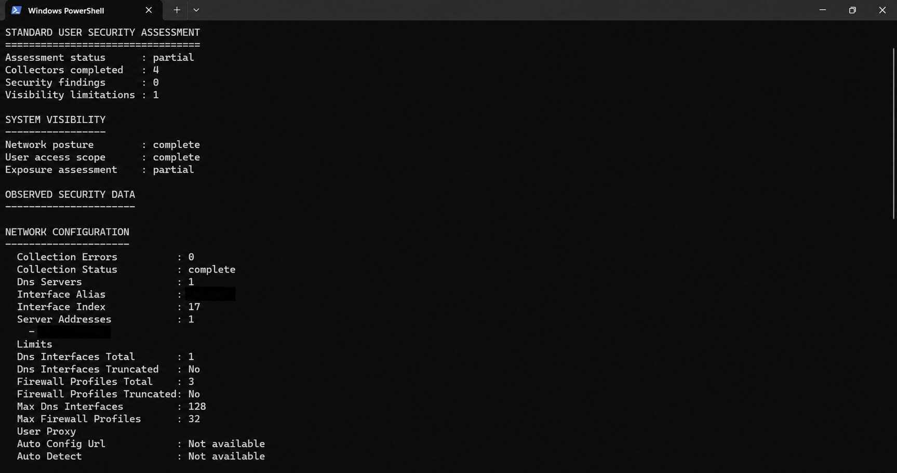

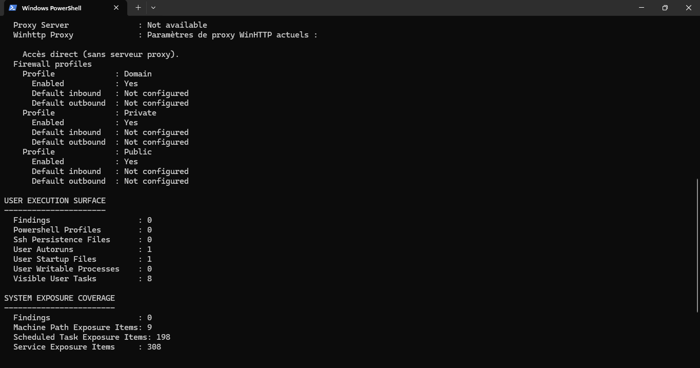

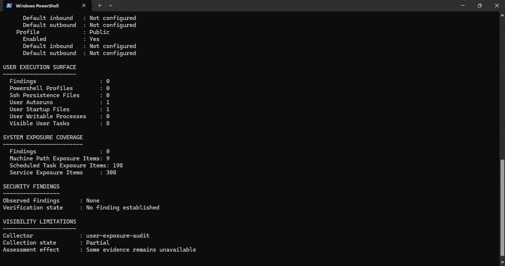

> Access restrictions are reported as visibility limitations. They are **not** proof that the restricted area is clean.

```powershell
.\axios.ps1 -Mode User -Save
```

---

## Administrator

Open PowerShell with **Run as Administrator**, return to the AXIOS folder, then:

```powershell
.\axios.ps1 -Mode Administrator
```

This is the **complete** AXIOS investigation: 42 stages covering persistence, processes and live activity, runtime CPU and memory, hardware and firmware trust, kernel and driver trust, network posture and exposure, security controls, Defender, software and updates, event correlation, file and application investigation, boot and Code Integrity, identity and credential access, collection integrity, cross-source correlation, investigation state, Reasoning Web, and response planning.

**Expected progress:**

```text
[1/42] ...
[2/42] ...
[42/42] ...
```

**Expected final heading:** `COMPREHENSIVE SECURITY INVESTIGATION`

**Final summary includes:**

| Group | Fields |
|---|---|
| **Run state** | Completion state, Reports observed, Reports failed, Reports partial |
| **Findings** | High-priority findings, Medium findings, Raw context records, Collection errors |
| **Reasoning** | Leading hypothesis, Hypothesis score, Independent sources, Contradictions, Unresolved facts, Next best checks |


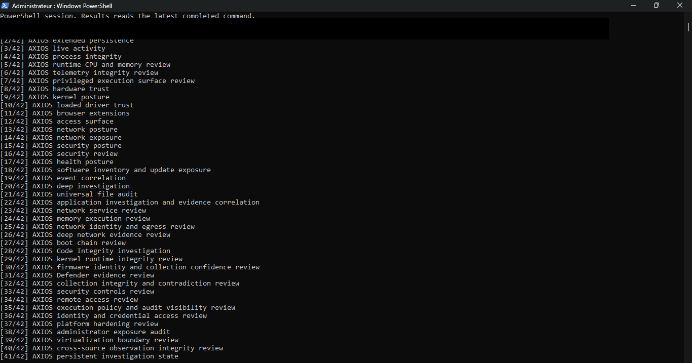

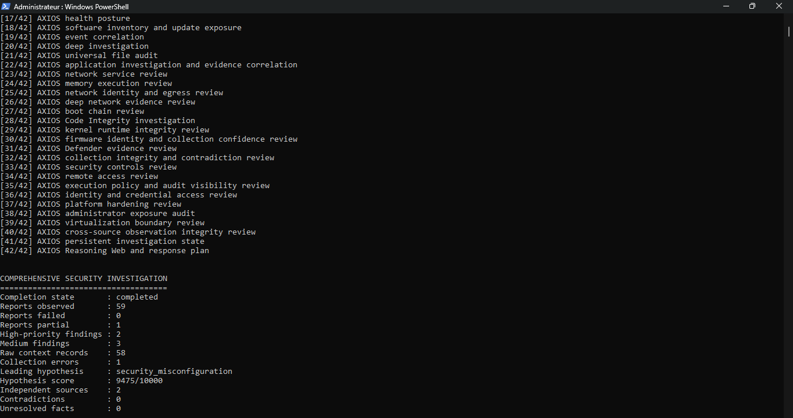

### Smart file audit

```powershell
.\axios.ps1 -Mode Administrator -AuditMode smart -MaxFiles 5000
```

Keeps the full investigation while selecting the smart file-audit behavior and a maximum file-candidate limit. A reached limit is reported as **partial coverage**, never hidden.

---

## System

```powershell
.\axios.ps1 -Mode System
```

**Expected heading:** `SYSTEM SECURITY ASSESSMENT`

Reviews hardware trust, Secure Boot, TPM, BitLocker visibility, virtualization-based security, kernel posture, driver trust, security controls, system health, boot protections, and context observations.

| Focus | Command | What it does |
|---|---|---|
| `overview` | `.\axios.ps1 -Mode System -SystemFocus overview` | Broad system-security overview |
| `quick` | `.\axios.ps1 -Mode System -SystemFocus quick` | Focused review of important system-control evidence |
| `context` | `.\axios.ps1 -Mode System -SystemFocus context` | Contextual evidence that may explain or support other findings |

```powershell
.\axios.ps1 -Mode System -Save
```


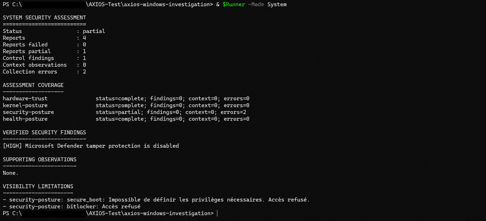

---

## Network

```powershell
.\axios.ps1 -Mode Network
```

**Expected heading:** `NETWORK SECURITY ASSESSMENT`

Can review adapters, IP configuration, DNS, routes, neighbors, firewall profiles, firewall-rule visibility, wireless configuration, TCP connections, UDP endpoints, listening services, and security-relevant observations.

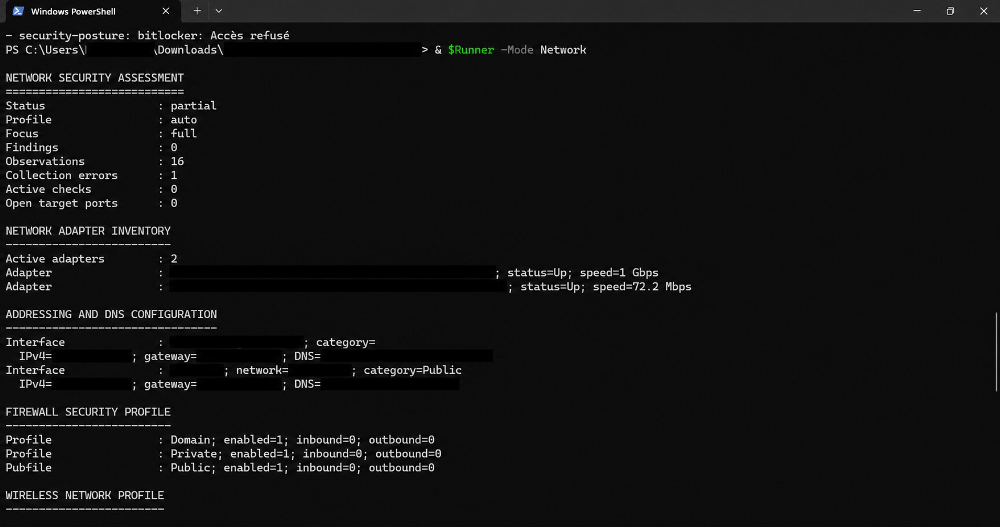

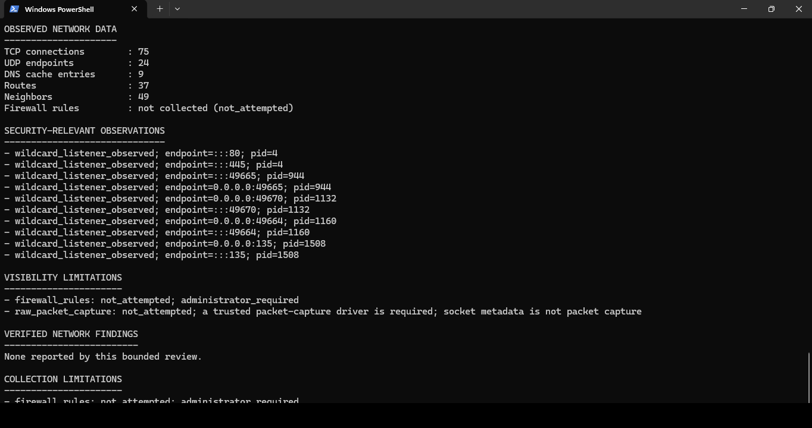

| Focus | Command | What it reviews |
|---|---|---|
| `overview` | `-NetworkFocus overview` | Concise network-security overview |
| `services` | `-NetworkFocus services` | Listening services and process/service context |
| `connections` | `-NetworkFocus connections` | Active TCP connections and UDP endpoints |
| `routing` | `-NetworkFocus routing` | Routes, gateways, interfaces, neighbor evidence |
| `dns` | `-NetworkFocus dns` | DNS configuration and DNS-related evidence |
| `firewall` | `-NetworkFocus firewall` | Firewall profiles and available rule evidence |
| `wifi` | `-NetworkFocus wifi` | Active wireless profile and connection properties |
| `full` | `-NetworkFocus full` | The complete bounded Network view |

Prefix each with `.\axios.ps1 -Mode Network`.

### Firewall note

Some firewall information requires Administrator. When it can't be collected, AXIOS reports:

```text
not collected
not_attempted
administrator_required
```

It never displays an unavailable rule count as zero.

### Wi-Fi note

Normal Network mode does **not** display the Wi-Fi password.

### Explicit target and port checks

```powershell
.\axios.ps1 -Mode Network -NetworkFocus connections -Target 192.0.2.10 -Ports 80,443
.\axios.ps1 -Mode Network -NetworkFocus connections -Target server.example.invalid -Ports 443,8443
```

Targets must be **explicit hostnames or IP addresses**. AXIOS rejects CIDR ranges, wildcards, whitespace, command-like input, invalid ports, port zero, and implicit network ranges.

| Rejected input | Reason |
|---|---|
| `192.168.1.0/24` | CIDR range |
| `192.168.*.*` | Wildcard |
| `127.0.0.1 && whoami` | Command-like input |
| `127.0.0.1;calc.exe` | Command-like input |
| `$(whoami)` | Command-like input |
| `0` | Invalid port |

> Only perform target checks against systems you own or are authorized to assess.

```powershell
.\axios.ps1 -Mode Network -NetworkFocus full -Save
```

---

## Persistence

```powershell
.\axios.ps1 -Mode Persistence
```

**Expected heading:** `PERSISTENCE SECURITY ASSESSMENT`

Reviews Registry Run entries, startup commands, startup folders, scheduled tasks, services, extended persistence sources, WMI permanent event subscriptions, and persistence collection coverage.

**Typical result groups:** `ASSESSMENT COVERAGE`, `PERSISTENCE SURFACE`, `WMI PERSISTENCE SUBSCRIPTIONS`.

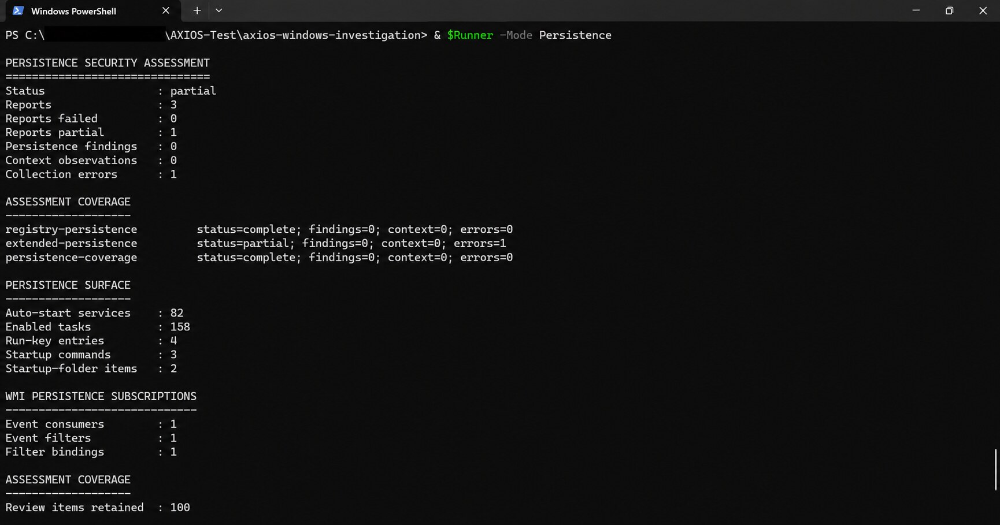

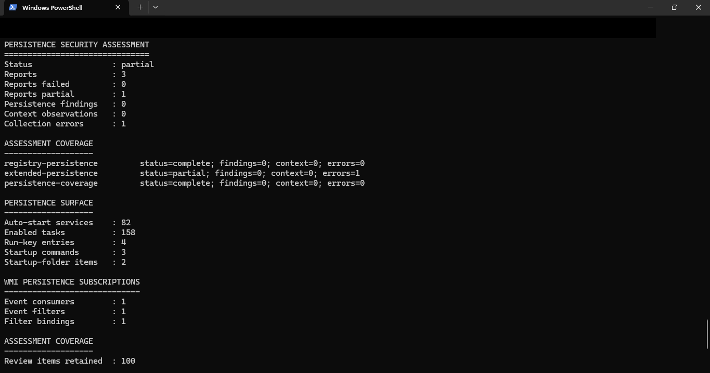

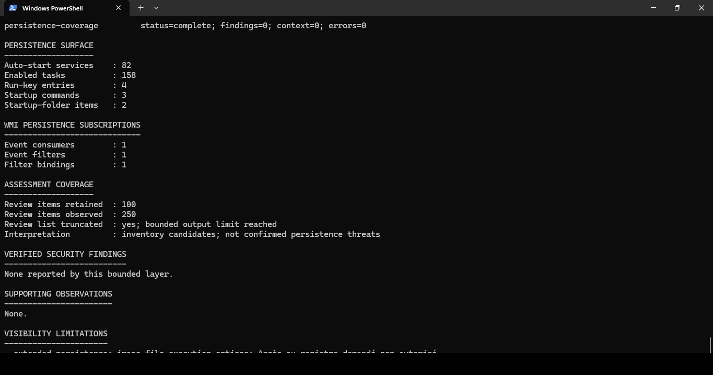

> A `partial` result means at least one persistence capability could not be collected completely.

---

## Software

```powershell
.\axios.ps1 -Mode Software
```

Reviews installed software, inventory, update exposure, application posture, browser-extension evidence, and software-related security observations.

> It reports what it observes. It does **not** remove or update applications.

---

## Results

```powershell
.\axios.ps1 -Mode Results
```

Shows the latest completed assessment from the **current PowerShell session**. Run it in the same session as the investigation:

```powershell
.\axios.ps1 -Mode User
.\axios.ps1 -Mode Results
```

**Expected heading:** `SECURITY ASSESSMENT SUMMARY`

Results separates verified security findings, review items, forensic visibility, context observations, collection coverage, unresolved verification, and next-best checks.

> If PowerShell is closed, unsaved session-only results are gone.

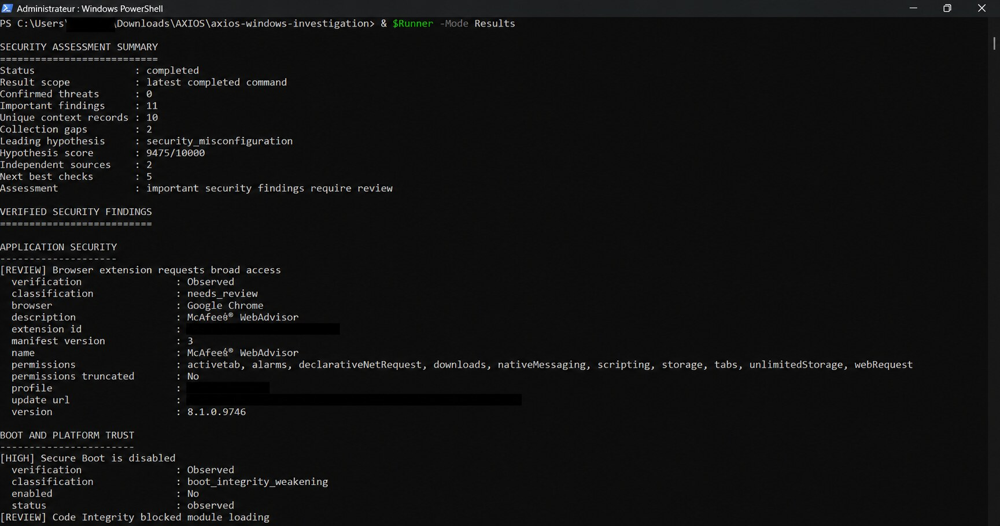

---

## Developer commands

Excluded from public Help and isolated from normal collection workflows.

### DeveloperExposure

```powershell
.\axios.ps1 -Mode DeveloperExposure
```

Runs from a standard or elevated session. **Heading:** `ADVANCED EXPOSURE ASSESSMENT`.

Displays assessment status, collectors returned, observations (with high and medium severity counts), execution context, configuration exposures, and visibility limitations.

> It reports evidence. It does **not** exploit discovered weaknesses.


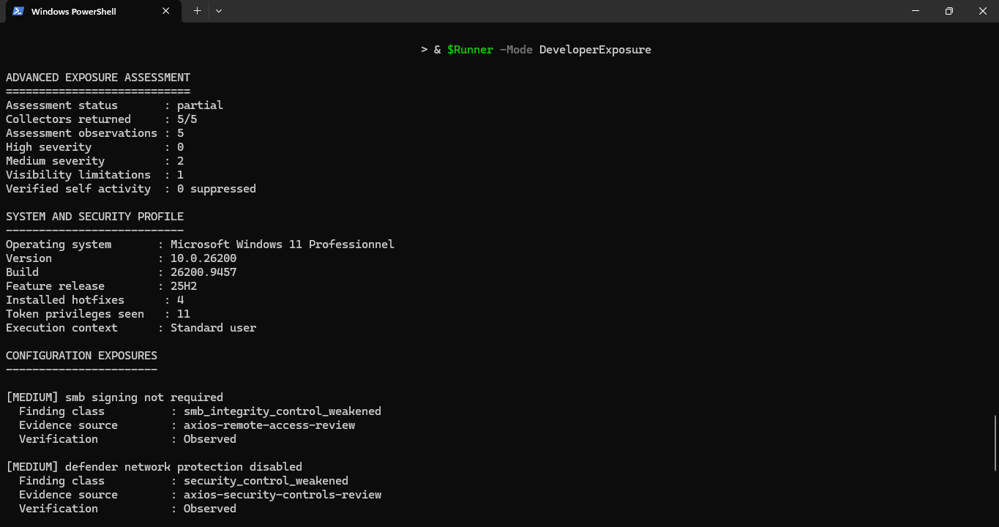

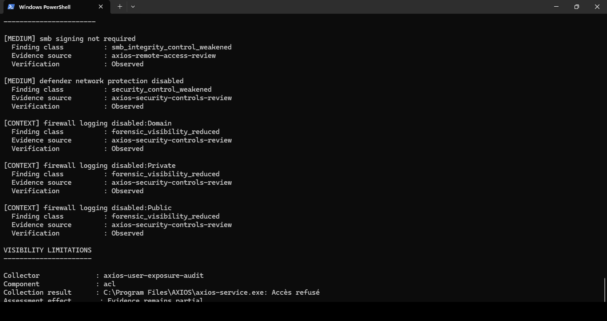

### DeveloperCredential

```powershell
.\axios.ps1 -Mode DeveloperCredential
```

Runs from a standard session and shows the active Wi-Fi profile credential in the terminal. **Heading:** `PRIVATE NETWORK CREDENTIAL ACCESS`.

**Displayed fields:** SSID, Authentication, Cipher, Wi-Fi password.

AXIOS then asks:

```text
Save an encrypted copy? [Y/N]:
```

- **N** or Enter: no file is created.
- **Y**: an encrypted `.dat` archive is created in Downloads.

| Export property | Value |
|---|---|
| Cipher | AES-256-GCM (authenticated) |
| Key derivation | PBKDF2-SHA256, 200,000 iterations |
| Archive identity | Random |
| Plaintext file | None |
| Minimum password | 12 bytes |

### DeveloperArchive

```powershell
.\axios.ps1 -Mode DeveloperArchive
```

Lists compatible encrypted archives in Downloads, then:

1. Select an archive.
2. Enter its encryption password.
3. AXIOS authenticates and decrypts it.

Output appears in the terminal under **`ENCRYPTED CREDENTIAL ARCHIVE`**. No plaintext file is created. If no compatible archive exists, AXIOS says so.

---

## Saving evidence

Without `-Save`, evidence exists only during the current PowerShell session.

```powershell
.\axios.ps1 -Mode User -Save
.\axios.ps1 -Mode System -Save
.\axios.ps1 -Mode Network -NetworkFocus full -Save
```

Use `-Save` only when you want to retain artifacts. **Before sharing saved evidence, review it for:**

- Usernames
- Machine names
- Internal paths
- IP addresses
- Installed software
- Browser information
- Security configuration
- Other environment-specific evidence

---

## Parameters

| Parameter | Used with | Purpose |
|---|---|---|
| `-Mode` | All commands | Selects the AXIOS operation |
| `-SystemFocus` | `System` | `overview`, `quick`, or `context` |
| `-NetworkFocus` | `Network` | Selects the Network investigation view |
| `-Target` | Targeted Network checks | One explicit hostname or IP address |
| `-Ports` | Network target checks | Explicit ports |
| `-AuditMode` | `Administrator` | Selects the file-audit behavior |
| `-MaxFiles` | `Administrator` | Bounded file-candidate limit |
| `-Save` | Supported assessment modes | Retains investigation artifacts |

Mode-specific parameters are **rejected** with unrelated modes.

```powershell
# Invalid
.\axios.ps1 -Mode User -NetworkFocus full

# Correct
.\axios.ps1 -Mode Network -NetworkFocus full
```

---

## Understanding results

### Collection status

| Status | Meaning |
|---|---|
| `complete` | Bounded collection completed without a reported gap |
| `partial` | Useful evidence collected, but visibility was limited |
| `failed` | No valid result produced |
| `not_attempted` | Not requested, or prerequisites unavailable |
| `unknown` | Evidence can't support a truthful state |

A partial result isn't always a software failure. It can mean Administrator access was required, a Windows capability was unavailable, a bounded limit was reached, a protected component denied access, or only part of the evidence could be collected.

### Finding levels

| Level | Meaning |
|---|---|
| **High priority** | Verified condition requiring urgent review |
| **Medium** | Verified weakness with meaningful exposure |
| **Review item** | Observed evidence requiring human validation |
| **Context** | Relevant state that is not proof of compromise |
| **Visibility limitation** | Evidence could not be collected completely |
| **Collection error** | Explicit collector or capability failure |

> A finding does not automatically mean the system is compromised.

---

## Troubleshooting

### "Administrator mode requires elevation"

1. Close the current PowerShell window.
2. Open PowerShell with **Run as Administrator**.
3. Return to the AXIOS folder and rerun:

```powershell
Set-Location "$env:USERPROFILE\Downloads\AXIOS\axios-windows-investigation"
.\axios.ps1 -Mode Administrator
```

### Results can't find a completed assessment

Run `Results` in the **same** PowerShell session, or use `-Save` to retain artifacts:

```powershell
.\axios.ps1 -Mode User
.\axios.ps1 -Mode Results
```

### Package integrity failure

Re-extract the official ZIP into a clean folder. Never run AXIOS from an incomplete extraction.

```powershell
$Zip  = "$env:USERPROFILE\Downloads\axios-windows-investigation.zip"
$Root = "$env:USERPROFILE\Downloads\AXIOS-Clean"

Expand-Archive -LiteralPath $Zip -DestinationPath $Root -Force
Set-Location "$Root\axios-windows-investigation"

.\axios.ps1 -Mode Help
```

### Script execution is blocked

Allow it for the **current process only**, without changing the system policy:

```powershell
Set-ExecutionPolicy -Scope Process -ExecutionPolicy Bypass
.\axios.ps1 -Mode Help
```

### A report is partial

Read the displayed visibility limitations and collection errors. A partial result means AXIOS preserved incomplete visibility instead of falsely claiming full coverage.

---

## Fastest safe starting points

| Goal | Commands |
|---|---|
| **Normal user** | `.\axios.ps1 -Mode User` then `.\axios.ps1 -Mode Results` |
| **Administrator** | `.\axios.ps1 -Mode Administrator` then `.\axios.ps1 -Mode Results` |
| **Network** | `.\axios.ps1 -Mode Network -NetworkFocus full` then `.\axios.ps1 -Mode Results` |
| **System** | `.\axios.ps1 -Mode System` then `.\axios.ps1 -Mode Results` |
| **Persistence** | `.\axios.ps1 -Mode Persistence` then `.\axios.ps1 -Mode Results` |

---

## Command principle

```text
Select a mode.
Choose an optional focused branch.
Run the assessment.
Review the result.
Save evidence only when needed.
```

The interface is intentionally smaller than the internal architecture. Operators should never need to understand or invoke the 46 native components individually.

---
