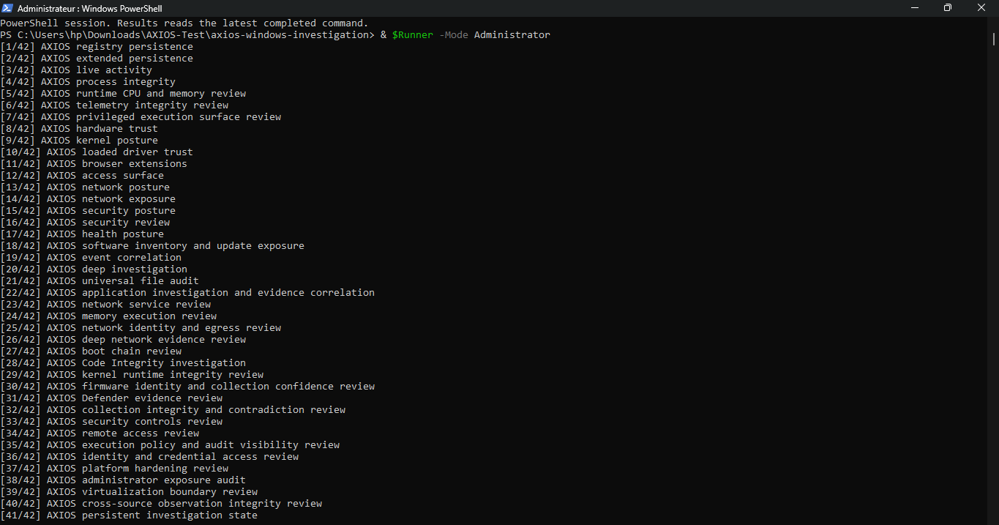
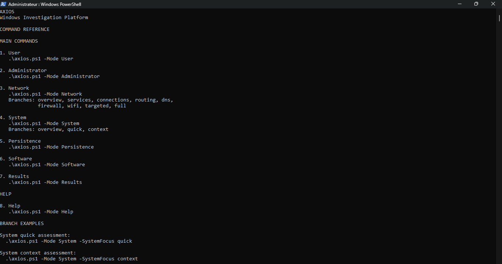
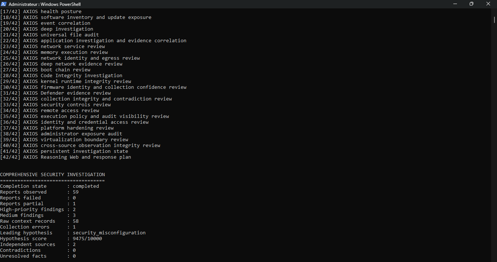
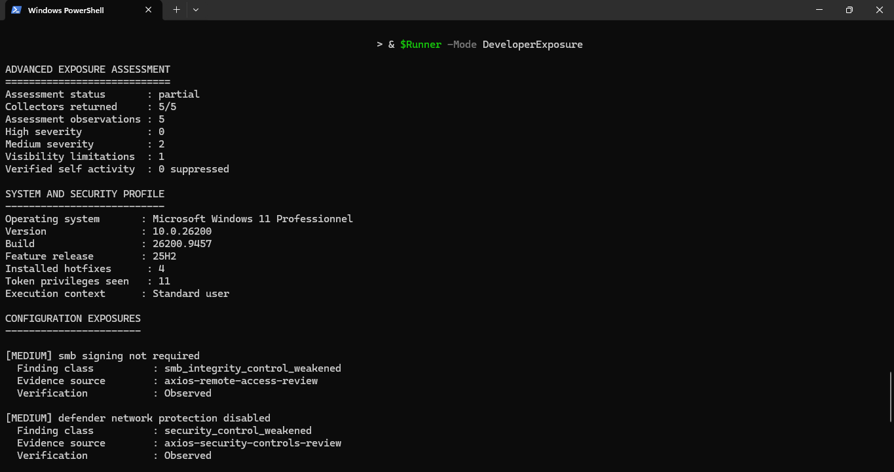

# AXIOS

### Windows Investigation Platform

**Evidence first. Honest about what it can't see.**


> A missing signal is not a clean system. An unverified observation is not a confirmed threat. AXIOS is built around that distinction.

---

## Contents

- [What is AXIOS](#what-is-axios)
- [What AXIOS is not](#what-axios-is-not)
- [By the numbers](#by-the-numbers)
- [Quick start](#quick-start)
- [Investigation philosophy](#investigation-philosophy)
- [Why Rust](#why-rust)
- [Architecture](#architecture)
- [Validated runtime](#validated-runtime)
- [Public commands](#public-commands)
- [Developer commands](#developer-commands)
- [Reading the results](#reading-the-results)
- [Saving artifacts](#saving-artifacts)
- [Building from source](#building-from-source)
- [FAQ](#faq)
- [Security, contributing, license](#security)

---

## What is AXIOS

AXIOS is a Windows security investigation, evidence-correlation, and forensic-reasoning platform built with **Rust** and **PowerShell**.

It does not just scan and print a verdict. It collects evidence across many layers of the operating system, correlates those layers against each other, and reports each conclusion together with how well it is supported. Where it couldn't see something, it says so.

The first stable release, dated **1 October 2026**, was researched and engineered independently over two months and more than 700 hours of development, testing, runtime validation, and source review.

## What AXIOS is not

- **Not an antivirus.** It investigates and reports; it doesn't quarantine or clean.
- **Not a remediation tool.** It never kills processes, deletes artifacts, or changes security settings.
- **Not a "everything suspicious is malware" scanner.** Unusual does not mean malicious, and AXIOS won't claim compromise from one unsupported indicator.
- **Not a black box.** Every finding keeps its evidence provenance, and every collector reports its own status.

---

## By the numbers

| Measurement | Value |
|---|---:|
| Total implementation and test code | **51,015 lines** |
| Production Rust | 37,361 lines |
| Rust test code | 3,800 lines |
| Total Rust | 41,161 lines |
| PowerShell orchestration | 9,644 lines |
| Shell build automation | 210 lines |
| Rust source files / test files / total | 134 / 71 / 205 |
| PowerShell files / Shell files | 14 / 2 |
| Rust functions | 1,534 |
| PowerShell functions | 60 |
| Packaged Windows executables | **46** |
| Administrator investigation stages | **42** |
| Reports in final validation | **59** |
| Failed reports in final validation | **0** |
| Development period | 2 months |
| Focused engineering and validation | 700+ hours |

**What the code is made of**

- **Production Rust** handles Windows-native evidence collection, bounded analysis, integrity verification, cross-source correlation, investigation state, forensic reasoning, and structured reporting.
- **Rust tests** validate runtime behavior, command contracts, evidence precision, privacy boundaries, Windows compatibility, package integrity, and failure semantics.
- **PowerShell** provides the public command interface and coordinates the isolated native collectors.
- **Shell tooling** handles cross-compilation, packaging, manifest generation, source archiving, and release validation.

---

## Quick start

```powershell
# See everything AXIOS can do
.\axios.ps1 -Mode Help

# No admin required
.\axios.ps1 -Mode User

# Full 42-stage investigation (run PowerShell as Administrator)
.\axios.ps1 -Mode Administrator

# Review the latest completed assessment in this session
.\axios.ps1 -Mode Results
```

Download `axios-windows-investigation.zip` from **GitHub Releases**, extract it, and run from PowerShell.

---

## Investigation philosophy

AXIOS follows five operating principles.

### 1. Evidence before conclusions
Every security conclusion must connect to collected evidence. Observations, contextual conditions, and confirmed findings are always kept separate.

### 2. Bounded execution
Collectors run under explicit limits for time, files, events, memory regions, output size, and evidence volume. When a limit is reached, AXIOS reports **partial visibility** instead of presenting incomplete evidence as complete.

### 3. Truthful uncertainty
AXIOS distinguishes between verified findings, review items, contextual observations, collection gaps, and unsupported conclusions. A failed or unavailable collector never becomes clean evidence.

### 4. Independent corroboration
Evidence from processes, services, persistence, network state, memory, boot integrity, security controls, software, and event logs is correlated before a higher-confidence conclusion is created.

### 5. Non-destructive investigation
Public commands collect and assess. They do not modify security controls, delete artifacts, terminate processes, or remediate the system.

---

## What AXIOS investigates

| Area | Coverage |
|---|---|
| **Persistence** | Registry and extended persistence, services, scheduled tasks, startup folders, WMI permanent event subscriptions |
| **Execution** | Processes, runtime activity, CPU and memory behavior |
| **Privilege** | User and administrator exposure, privileged execution surfaces |
| **Platform trust** | Hardware and firmware identity, Secure Boot, boot-chain posture |
| **Kernel** | Kernel posture, runtime integrity, loaded driver trust, native Authenticode verification, Code Integrity evidence |
| **Network** | Adapters, DNS, routing, firewall, Wi-Fi, listeners, connections, services |
| **Defenses** | Security controls and Microsoft Defender evidence |
| **Software** | Inventory and update exposure, browser extensions |
| **Identity** | Credential-access posture, access-control exposure |
| **Isolation** | Virtualization boundaries |
| **Correlation** | Event correlation, file and artifact investigation, cross-source observation integrity |
| **Reasoning** | Persistent investigation state, bounded reasoning, response planning |

---

## Why Rust

Security investigation software has to process untrusted, incomplete, and structurally inconsistent evidence without becoming a vulnerability itself.

Rust provides:

- Memory safety without a garbage collector
- Native performance for collection and analysis
- Strong ownership and resource-lifetime guarantees
- Explicit error propagation through `Result`
- Strong typing for evidence models and investigation states
- Predictable memory and execution behavior
- Direct integration with native Windows APIs
- Standalone Windows executables
- Safer concurrency for independent collection workloads
- Compile-time prevention of broad classes of memory errors

Rust isn't a marketing label here. It's the foundation of the collectors, evidence models, verification logic, correlation layers, and bounded reasoning.

**PowerShell** stays as the public orchestration layer because it's a practical, transparent interface for Windows operators, while the security-sensitive analysis stays inside compiled Rust components.

---

## Architecture

```text
Public PowerShell entrypoint
            │
            ▼
Parameter and privilege validation
            │
            ▼
Shared bounded layer runner
            │
            ▼
Isolated Rust investigation executables
            │
            ▼
Structured evidence reports
            │
            ▼
Collection integrity and contradiction review
            │
            ▼
Cross-source correlation
            │
            ▼
Reasoning Web
            │
            ▼
Response plan and Results renderer
```

The entrypoint validates the requested mode, parameters, execution context, package contents, and privilege boundaries. Each layer returns structured evidence with explicit status, findings, observations, errors, and collection limitations.

Correlation and reasoning only run **after** collection. They preserve provenance and never silently turn context into a confirmed threat.

See [Architecture](docs/ARCHITECTURE.md) for the full technical design.

---

## Validated runtime



The final administrator validation run on Windows:

```text
Completion state       : completed
Reports observed       : 59
Reports failed         : 0
Reports partial        : 1
High-priority findings : 2
Medium findings        : 3
Contradictions         : 0
Unresolved facts       : 0
```

The single partial report came from a bounded file-audit candidate limit. AXIOS recorded it as a **collection limitation** rather than claiming full file-system visibility. That is the design working as intended.

---

## Public commands

### Help
Shows the supported interface, focused branches, parameters, and examples.

```powershell
.\axios.ps1 -Mode Help
```


### User
Runs from a standard or elevated session. Reviews user execution surfaces, accessible network configuration, startup artifacts, user-visible tasks, and exposure evidence available within the current token.

```powershell
.\axios.ps1 -Mode User
```


### Administrator
The complete **42-stage** investigation. Coordinates all primary collectors, integrity reviews, evidence correlation, investigation state, Reasoning Web, and response planning. Requires PowerShell as Administrator.

```powershell
.\axios.ps1 -Mode Administrator

# Optional smart file audit
.\axios.ps1 -Mode Administrator -AuditMode smart -MaxFiles 5000
```


### System
Hardware trust, kernel posture, security posture, health posture, boot protections, and system-control evidence.

```powershell
.\axios.ps1 -Mode System
.\axios.ps1 -Mode System -SystemFocus overview
.\axios.ps1 -Mode System -SystemFocus quick
.\axios.ps1 -Mode System -SystemFocus context
```


### Network
Adapters, addresses, DNS, routing, firewall state, wireless configuration, listeners, connections, services, and bounded targeted checks.

```powershell
.\axios.ps1 -Mode Network
.\axios.ps1 -Mode Network -NetworkFocus overview
.\axios.ps1 -Mode Network -NetworkFocus services
.\axios.ps1 -Mode Network -NetworkFocus connections
.\axios.ps1 -Mode Network -NetworkFocus routing
.\axios.ps1 -Mode Network -NetworkFocus dns
.\axios.ps1 -Mode Network -NetworkFocus firewall
.\axios.ps1 -Mode Network -NetworkFocus wifi
.\axios.ps1 -Mode Network -NetworkFocus full
```

Explicit, authorized target checks:

```powershell
.\axios.ps1 -Mode Network -NetworkFocus connections -Target 192.0.2.10 -Ports 80,443
```

> Targets must be explicit hostnames or IP addresses. CIDR ranges, wildcards, whitespace, and command-like input are rejected.


### Persistence
Registry Run entries, startup commands, services, scheduled tasks, startup folders, extended persistence, and WMI permanent event subscriptions.

```powershell
.\axios.ps1 -Mode Persistence
```

### Software
Installed software, update exposure, relevant application posture, and inventory evidence.

```powershell
.\axios.ps1 -Mode Software
```

### Results
Shows the latest completed assessment from the current PowerShell session, separating verified findings, forensic context, collection gaps, and unresolved verification items.

```powershell
.\axios.ps1 -Mode Results
```

---

## Developer commands

Intentionally excluded from public Help output and isolated from normal collection workflows.

| Command | Purpose |
|---|---|
| `DeveloperExposure` | Advanced exposure assessment from a standard or elevated session |
| `DeveloperCredential` | Shows the active Wi-Fi credential in the terminal, with optional encrypted export |
| `DeveloperArchive` | Selects and decrypts an AXIOS encrypted credential archive in the terminal |

```powershell
.\axios.ps1 -Mode DeveloperExposure
.\axios.ps1 -Mode DeveloperCredential
.\axios.ps1 -Mode DeveloperArchive
```



**Encrypted export guarantees**

- AES-256-GCM authenticated encryption
- Password-based key derivation
- Random archive identity
- No plaintext output file
- Archive authentication is verified **before** any content is displayed on decrypt

---

## Reading the results

### Collection status

| Status | Meaning |
|---|---|
| `complete` | Bounded collection finished with no reported gap |
| `partial` | Useful evidence collected, but a limit or unavailable capability reduced visibility |
| `failed` | The collector did not produce a valid result |
| `not_attempted` | Not requested, or prerequisites were unavailable |
| `unknown` | Available evidence can't support a truthful status |

A `partial` result is **not necessarily a software failure**. It can mean an access restriction, a bounded evidence limit, an unavailable Windows capability, or a collector that truthfully preserved incomplete visibility.

### Findings model

| Tier | Meaning |
|---|---|
| **High-priority** | Verified conditions requiring urgent review |
| **Medium** | Verified weaknesses with meaningful exposure |
| **Review items** | Observed evidence needing operator validation |
| **Context observations** | Relevant state that is not itself proof of compromise |
| **Visibility limitations** | Evidence that couldn't be collected completely |
| **Collection errors** | Explicit collector or capability failures |

---

## Saving artifacts

Without `-Save`, assessment evidence exists only for the current PowerShell session. Add `-Save` to retain artifacts:

```powershell
.\axios.ps1 -Mode System -Save
.\axios.ps1 -Mode Network -NetworkFocus full -Save
.\axios.ps1 -Mode User -Save
```

`Results` reads the latest completed command available to the session.

---

## Building from source

**Requirements**

- Rust toolchain and Cargo
- PowerShell
- MinGW-w64 toolchain for the Windows GNU target
- `x86_64-pc-windows-gnu` Rust target
- ZIP and standard Unix build utilities

**Verify**

```bash
cargo fmt --check
cargo test --all-targets
cargo clippy --all-targets --all-features -- -D warnings
```

**Build the Windows distribution**

```bash
./scripts/build-windows-complete-investigation.sh
```

The release builder compiles the executables, assembles the package, generates the SHA-256 manifest, and validates the packaged interface.

**Repository layout**

```text
src/         Rust collectors, analysis, evidence models, and binaries
tests/       Integration, runtime, precision, privacy, and contract tests
installer/   Windows PowerShell orchestration and package assets
scripts/     Build, packaging, and public launcher tooling
docs/        Architecture, command, investigation, and security documentation
.github/     Issue and pull-request templates
```

Build directories, investigation results, credentials, dumps, packet captures, keys, and local machine artifacts are excluded from the repository.

---

## FAQ

**Does AXIOS fix problems it finds?**
No. It's strictly non-destructive. It reports; you decide.

**Why does my run show a `partial` report?**
A limit (like the file-audit candidate cap) or an unavailable capability reduced visibility. AXIOS is telling you exactly where its view ends instead of hiding it.

**Do I need Administrator?**
Only for the full 42-stage investigation. `User` mode works from a standard session.

**Does a finding mean I'm compromised?**
Not by itself. Findings are tiered, and context observations are explicitly *not* proof of compromise.

**Can I scan a whole subnet?**
No. Targeted checks accept only explicit hostnames or IPs, by design.

---

## Release

| | |
|---|---|
| Release | October 2026, Stable |
| Date | 1 October 2026 |
| Source version | `2026.9.27` |
| Platform | Windows |
| Primary language | Rust |
| Distribution | `axios-windows-investigation.zip` on GitHub Releases |

## Security

Please **do not** report suspected vulnerabilities in a public issue. Follow the private process in [SECURITY.md](SECURITY.md).

AXIOS is intended only for authorized investigation of systems you own or are permitted to assess.

## Contributing

See [CONTRIBUTING.md](CONTRIBUTING.md) for requirements, validation commands, commit expectations, and pull-request standards. Any change affecting evidence interpretation must preserve:

- Evidence provenance
- Bounded execution
- Explicit error handling
- Truthful collection status
- Separation of findings and context
- Privacy and source-hygiene guarantees

## License

Licensed under the [Apache License 2.0](LICENSE).

Copyright © 2026 Adam-dods.

